# Naftis

[](https://github.com/xiaomi/naftis/blob/master/LICENSE)
[](https://travis-ci.org/XiaoMi/naftis)

[English](https://github.com/xiaomi/naftis/blob/master/README.md) | [中文](https://github.com/xiaomi/naftis/blob/master/README-CN.md)

Naftis is a web-based dashboard for Istio. It helps user manage their Istio tasks more easily.
Using Naftis we can custom our own task templates, then build task from them and execute it.

## Documentation

<!-- TOC -->

- [Naftis](#naftis)
  - [Dockmentation](#dockmentation)
  - [Code Structure](#code-structure)
  - [Features](#features)
  - [Requirements](#requirements)
    - [HIUI](#hiui)
  - [Quick Started](#quick-started)
  - [Detailed Deployments](#detailed-deployments)
    - [Running Under Kubernetes Cluster](#running-under-kubernetes-cluster)
    - [Running Under Local Machine](#running-under-local-machine)
      - [Migration](#migration)
      - [Start API Server](#start-api-server)
      - [Modify Nginx Proxy Config](#modify-nginx-proxy-config)
      - [Start Node Proxy Server](#start-node-proxy-server)
  - [Previews](#previews)
    - [Dashboard](#dashboard)
    - [Services](#services)
      - [Service Detail](#service-detail)
      - [Service Pod](#service-pod)
    - [Task Templates](#task-templates)
      - [Task Tpl](#task-tpl)
      - [Task View](#task-view)
      - [Task New](#task-new)
      - [Create Task](#create-task)
      - [Istio Diagnosis](#istio-diagnosis)
  - [Docker Images](#docker-images)
  - [Developer's Guide](#developers-guide)
    - [Fetch source code](#fetch-source-code)
    - [Setting environment variables](#setting-environment-variables)
    - [Go Dependency](#go-dependency)
    - [Code Style](#code-style)
  - [Other Directives](#other-directives)
  - [Architecture](#architecture)
  - [TODO List](#todo-list)
  - [License](#license)

<!-- /TOC -->

## Code Structure

```bash
.
├── bin                         # directory store binary
├── config                      # directory store configuration files
│   ├── in-cluster.toml         # in Kubernetes cluster configuration file
│   ├── in-local.toml           # in local machine configuration file
├── install                     # Helm Charts
│   └── helm
│       ├── mysql
│       └── naftis
├── src                         # source code
│   ├── api                     # backend server source code
│   │   ├── bootstrap           # store start arguments
│   │   ├── executor            # execute tasks from task queue
│   │   ├── handler             # HTTP handlers
│   │   ├── log                 # log package wraps zap
│   │   ├── middleware          # HTTP middlewares
│   │   ├── model               # common models
│   │   ├── router              # HTTP routers
│   │   ├── service             # some wraped services
│   │   ├── storer              # db storer
│   │   ├── util                # utilities
│   │   ├── version             # provides build-in version message
│   │   ├── worker              # task worker
│   │   └── main.go             # index of backend server
│   └── ui                      # frontend source code
│       ├── build               # webpack scripts
│       ├── src                 # truly frontend source code
│       ├── package.json
│       ├── package-lock.json
│       ├── postcss.config.js
│       ├── README-CN.md
│       └── README.md
├── tool                        # some shell and migrate scripts
│   ├── img
│   ├── apppkg.sh
│   ├── build.sh
│   ├── cleanup.sh              # clean up Naftis
│   ├── conn.sh
│   ├── genmanifest.sh          # generate manifest for Naftis deployment in Kubernetes
│   ├── gentmpl.go
│   ├── naftis.sql              # Naftis migrate sql scripts
│   ├── naftis.conf             # Naftis Nginx configuration file
│   └── version.sh
├── vendor                      # go dependencies
├── Dockerfile.api              # backend image dockerfile
├── Dockerfile.ui               # frontend image dockerfile
├── Gopkg.lock                  # dep depencies version lock file
├── Gopkg.toml                  # dep depencies version primarily hand-edited file
├── LICENSE
├── Makefile                    # project's makefile
├── mysql.yaml                  # Kubernetes Naftis API and UI manifest, generate by Helm
├── naftis.yaml                 # Kubernetes Naftis MySQL manifest, generate by Helm
├── README-CN.md
├── README.md
└── run                         # shortcut script for local running
```

## Features

- Integrates with some real-time dashboards
- Customizable task template
- Support Rollback specific task
- Optimized Istio service graph with supporting of specifying particular root service node
- With diagnose data of Istio services and pods
- Out of the box, easy deployment with `kubectl` commands
- Istio 1.0 supported

## Requirements

- Istio > 1.0
- Kubernetes >= 1.9.0
- HIUI >= 1.0.0

### HIUI

Naftis dashboard use powerful HIUI (A React based UI components which released by Xiaomi FE Team) to built responsive UI, more reference:

https://github.com/XiaoMi/hiui

## Quick Started

```bash
kubectl create namespace naftis && kubectl apply -n naftis -f mysql.yaml && kubectl apply -n naftis -f naftis.yaml

# port forward Naftis
kubectl -n naftis port-forward $(kubectl -n naftis get pod -l app=naftis-ui -o jsonpath='{.items[0].metadata.name}') 8080:80 &

# explorer http://localhost:8080/ with your browser, default user name and password is "admin".
```

## Detailed Deployments

### Running Under Kubernetes Cluster

```bash
# create Naftis namespace
$ kubectl create namespace naftis

# ensure Naftis namespace is created
$ kubectl get namespace naftis
NAME           STATUS    AGE
naftis         Active    18m

# deploy Naftis MySQL service
$ kubectl apply -n naftis -f mysql.yaml

# ensure MySQL service is deployed
$ kubectl get svc -n naftis
NAME                           READY     STATUS    RESTARTS   AGE
naftis-mysql-c78f99d6c-kblbq   1/1       Running   0          9s
naftis-mysql-test              1/1       Running   0          10s

# deploy Naftis API and UI service
$ kubectl apply -n naftis -f naftis.yaml

# ensure Naftis all services is correctly defined and running
$ kubectl get svc -n naftis
NAME           TYPE           CLUSTER-IP      EXTERNAL-IP   PORT(S)        AGE
naftis-api     ClusterIP      10.233.3.144    <none>        50000/TCP      7s
naftis-mysql   ClusterIP      10.233.57.230   <none>        3306/TCP       55s
naftis-ui      LoadBalancer   10.233.18.125   <pending>     80:31286/TCP   6s

$ kubectl get pod -n naftis
NAME                           READY     STATUS    RESTARTS   AGE
naftis-api-0                   1/2       Running   0          19s
naftis-mysql-c78f99d6c-kblbq   1/1       Running   0          1m
naftis-mysql-test              1/1       Running   0          1m
naftis-ui-69f7d75f47-4jzwz     1/1       Running   0          19s

# browse Naftis via port-forward
$ kubectl -n naftis port-forward $(kubectl -n naftis get pod -l app=naftis-ui -o jsonpath='{.items[0].metadata.name}') 8080:80 &
```

Explorer [http://localhost:8080/](http://localhost:8080/) with your browser, default user name and password is "admin".

### Running Under Local Machine

#### Migration

```bash
# run migrate sql script
mysql> source ./tool/naftis.sql;

# modify in-local.toml and replace with your own MySQL DSN.
```

#### Start API Server

- Linux

```bash
make build && ./bin/naftis-api start -c config/in-local.toml -i=false # building and starting naftis-api
```

or

```bash
./run
```

- Mac OS

```bash
GOOS=darwin GOARCH=amd64 make build && ./bin/naftis-api start -c config/in-local.toml -i=false # building and starting naftis-api
```

or

```bash
GOOS=darwin GOARCH=amd64 ./run
```

#### Modify Nginx Proxy Config

```bash
cp tool/naftis.conf <your-nginx-conf-directory>/naftis.conf
# modify naftis.conf and then reload Nginx
```

#### Start Node Proxy Server

```bash
cd src/ui
npm install
npm run dev # start node proxy

# Explorer http://localhost:5200/ with your browser.
```

## Previews

### Dashboard

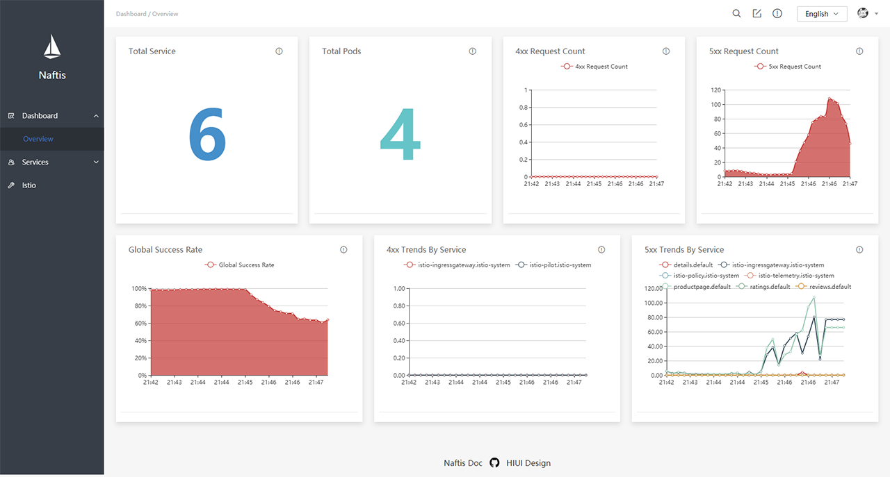

### Services

#### Service Detail

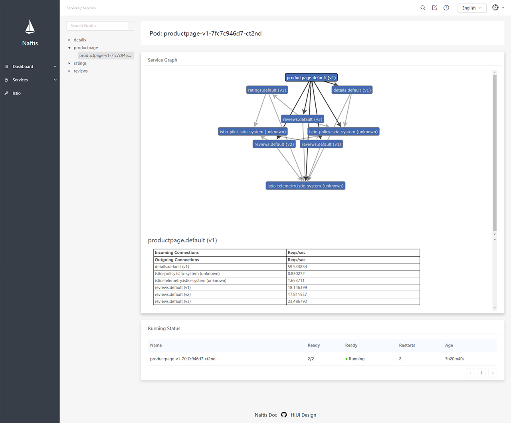

#### Service Pod

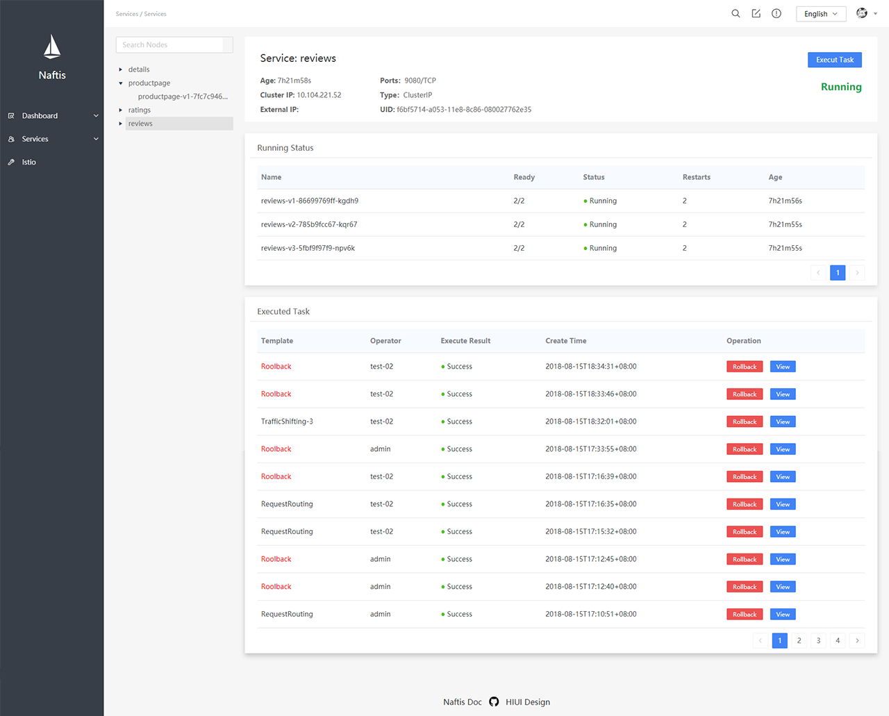

### Task Templates

#### Task Tpl

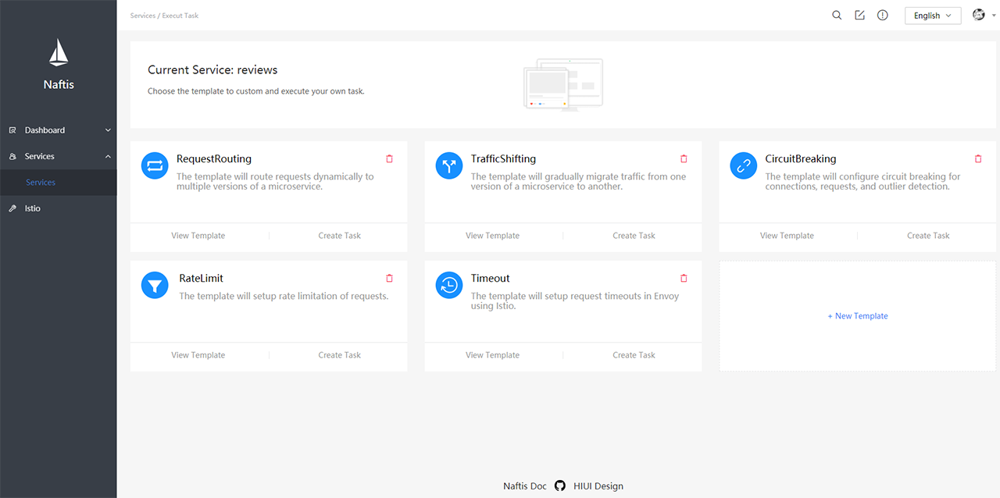

#### Task View

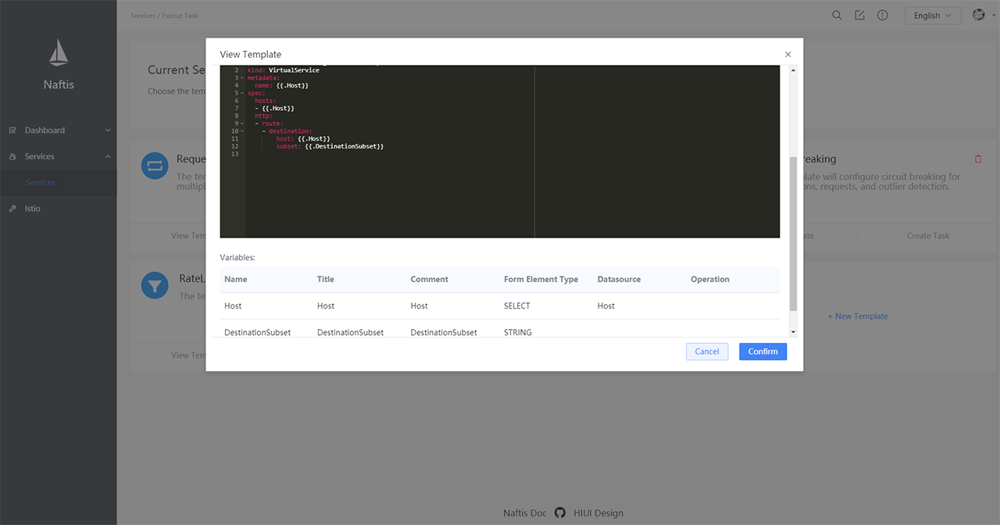

#### Task New

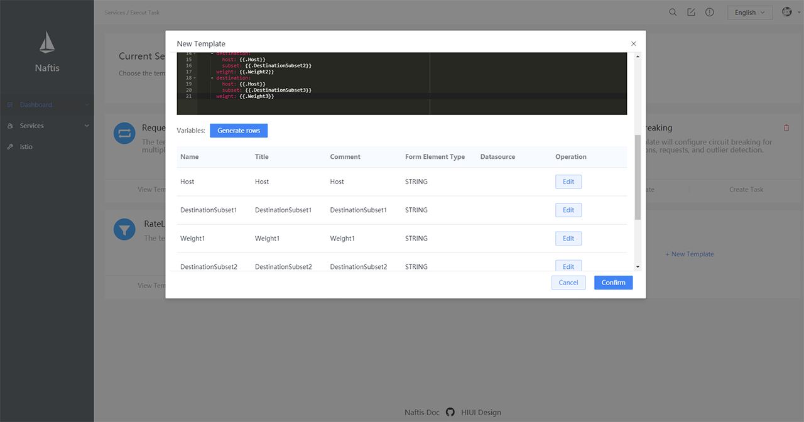

#### Create Task

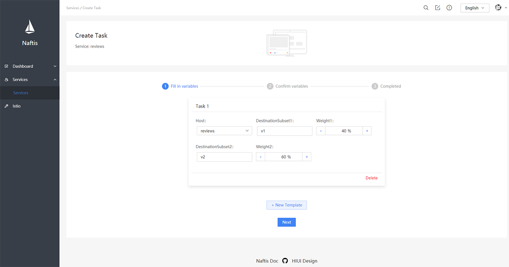

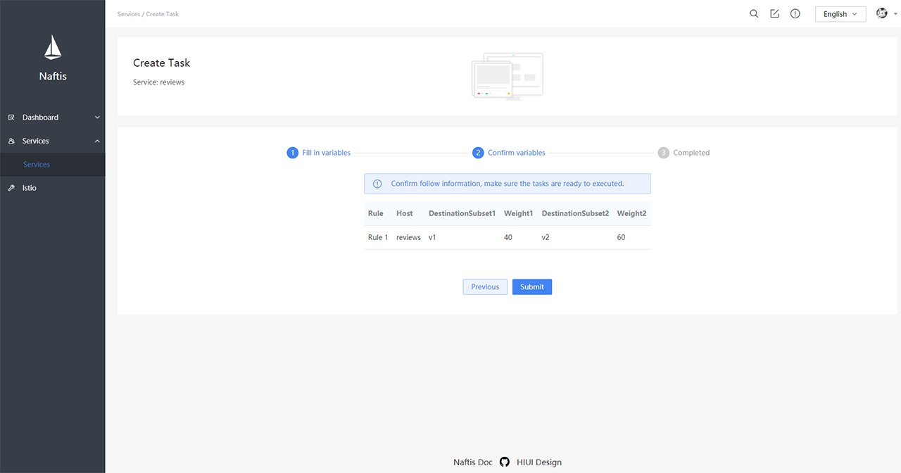

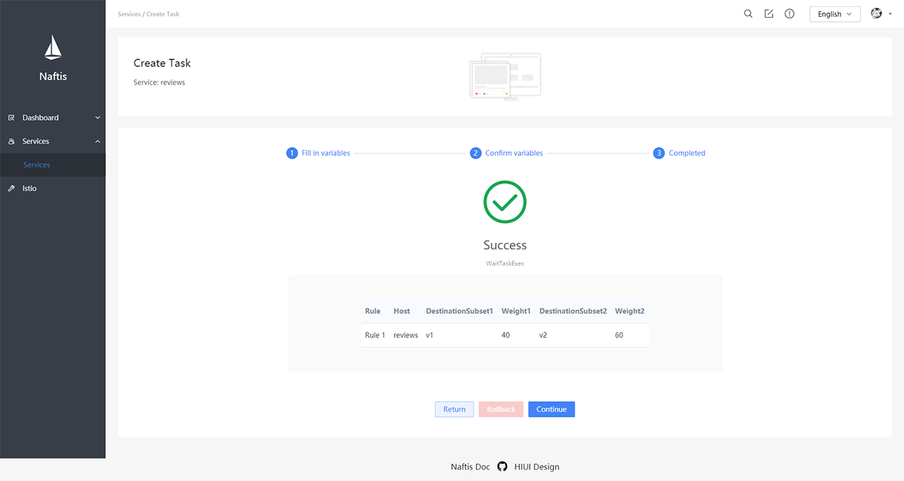

#### Istio Diagnosis

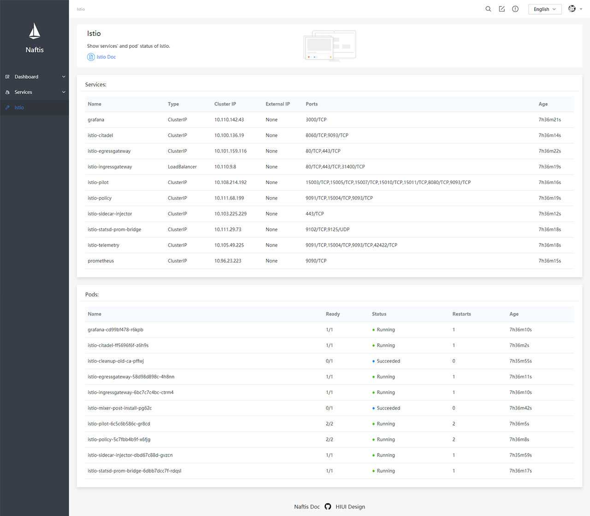

## Docker Images

Naftis api and ui image has been published on Docker Hub in [api](https://hub.docker.com/r/sevennt/naftis-api/) and [ui](https://hub.docker.com/r/sevennt/naftis-ui/).

## Developer's Guide

### Fetch source code

```bash
go get github.com/xiaomi/naftis
```

### Setting environment variables

Add the follow exports to your ~/.profile. [autoenv](https://github.com/kennethreitz/autoenv) is also strongly recommended.

```bash
# Change GOOS and GOARCH with your environment.
export GOOS="linux"   # or replace with "darwin", etc.
export GOARCH="amd64" # or replace with "386", etc.

# Change USER with your Docker Hub account for pulling and pushing custom docker container builds.
export USER="sevennt"
export HUB="docker.io/$USER"
```

If you choose [autoenv](https://github.com/kennethreitz/autoenv) to export environment variables, type `cd .` to make it work.

### Go Dependency

We use [dep](https://github.com/golang/dep) to manage our go dependencies.

```bash
# install dep
go get -u github.com/golang/dep
dep ensure -v # install dependcies
```

### Code Style

- [Go](https://github.com/golang/go/wiki/CodeReviewComments)
- [React](https://standardjs.com/)

## Other Directives

```bash
make                # make all targets

make build          # build api binaries, frontend assets, and Kubernetes manifest
make build.api      # build backend binaries
make build.ui       # build frontend assets
make build.manifest # build Kubernetes manifest

make fmt  # go fmt codes
make lint # lint codes
make vet  # vet codes
make test # run tests
make tar  # compress directories

make docker      # build docker images
make docker.api  # build backend docker images
make docker.ui   # build frontend docker images
make push        # push images to docker.io

./bin/naftis-api -h      # show help messages
./bin/naftis-api version # show binary build version messages

./tool/cleanup.sh # clean up Naftis
```

## Architecture

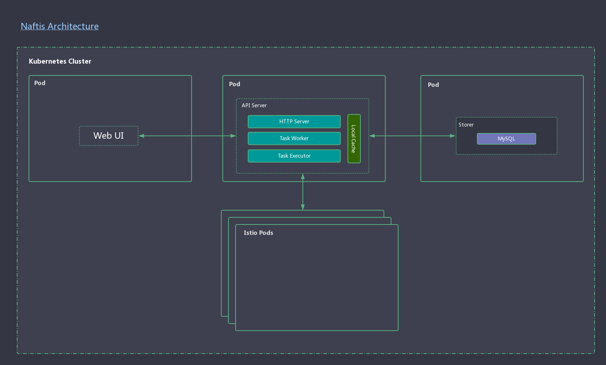

## TODO List

- [ ] Add testcases
- [ ] Supporting query Istio resource
- [ ] Add Links of Grafana, Jaeger, Prometheus

## License

[Apache License 2.0](https://github.com/xiaomi/naftis/blob/master/LICENSE)
